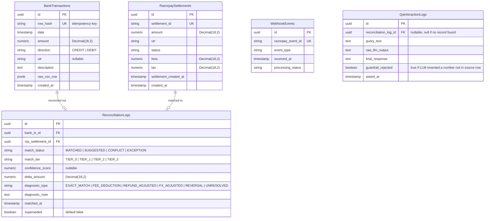

# ReconGrid AI — Technical Architecture

> **Stack note:** Backend is **Python (FastAPI + Pydantic v2 + SQLAlchemy/SQLModel + Postgres)**. Frontend remains **Next.js + Tailwind**, communicating with the backend over a versioned REST API (`/api/v1/...`). Razorpay is called directly via `httpx` against the REST API — no Node SDK.

## 1. High-Level Data Flow

```
[ Frontend: Next.js + Tailwind ]
         |
         |  1. Upload Bank Statement CSV (multipart/form-data)
         v
[ FastAPI: /api/v1/bank/upload ]
         |
         |  2. Streamed parse + sanitize -> canonical BankTransaction records
         v
[ PostgreSQL (SQLAlchemy/SQLModel) ] <---------------------------+
         ^                                                       |
         |  3. Fetch settlements/refunds (paginated, backoff)    |
         |                                                       |
[ Razorpay Fetcher Service (httpx + tenacity retry) ]            |
         ^                                                       |
         |  3b. Real-time settlement.processed webhook           |
[ FastAPI: /api/v1/webhooks/razorpay ] (HMAC-verified, idempotent)
         |                                                       |
         |  4. Load Bank + Razorpay datasets                     |
         v                                                       |
[ Reconciliation Engine (deterministic, Decimal-based) ] --------+ 5. Write matches/exceptions/diagnostics
         |
         |  6. Serve reconciled / suggested / exception datasets
         v
[ FastAPI: /api/v1/reconciliation/* ] --> [ Next.js Dashboard ]
```

---

## 2. Component Breakdown

### 2.1 Ingestion Service (`app/services/ingestion.py`)
* **Responsibility**: Ingest raw bank statement CSVs.
* **Core Functions**:
  * Streams CSVs (never loads full file into memory) with delimiter/header auto-detection for supported bank formats.
  * Normalizes each row into a `BankTransactionCreate` Pydantic model (`date`, `amount: Decimal`, `utr: str | None`, `direction: Literal["CREDIT","DEBIT"]`, `description`, `raw_csv_row: dict`).
  * **Idempotency**: computes a deterministic row hash (`sha256(date|amount|utr|raw_row)`) and upserts on that hash — re-uploading the same statement never duplicates rows.
  * Rejects non-CSV MIME types and files above a configured size ceiling before parsing begins, with a structured `400` response — never a silent partial ingest.

### 2.2 Razorpay Fetcher Service (`app/services/razorpay_client.py`)
* **Responsibility**: Interface with Razorpay REST API and webhooks.
* **Core Functions**:
  * `GET /v1/settlements` and `GET /v1/refunds` via `httpx.AsyncClient`, cursor-paginated (`count=100`, loop until `has_more` is false).
  * Retries with `tenacity` — exponential backoff + jitter, **hard ceiling of 5 attempts**, then raises `RazorpayFetchExhausted` and halts the job with an operator alert (never an infinite loop).
  * Upserts by `settlement_id` (unique constraint) — safe to re-run a sync job after interruption.
  * Webhook endpoint verifies `X-Razorpay-Signature` via HMAC-SHA256 over the **raw request body** *before* any JSON parsing or business logic runs. Invalid signature → `400`, logged, discarded.
  * Webhook events are deduplicated by Razorpay's `event.id` (stored in a `ProcessedWebhookEvent` table with a unique constraint) — retried/duplicate deliveries are accepted with `200` but produce no double-processing.

### 2.3 Reconciliation Engine (`app/services/reconciliation.py`)
* **Responsibility**: Deterministic matching and diagnostics. **No LLM involvement** — pure rules and arithmetic on `Decimal` values.
* **Tiers**:
  * **Tier 0 (Fallback)**: when `utr` is null/non-standard, match on `date window (±2 days) + exact amount`, flagged `SUGGESTED` (never auto-`MATCHED`, since it's weaker evidence).
  * **Tier 1 (Exact)**: `utr == utr` AND `amount == amount` → `MATCHED`.
  * **Tier 2 (Fuzzy)**: Levenshtein/Jaro-Winkler similarity ≥ 0.90 on descriptor text → `SUGGESTED`, requires human approval before it can affect the match rate.
  * **Tier 3 (Diagnostics)**: for unmatched-by-amount rows, evaluates `Δ = bank_amount - rzp_gross_amount` against: (a) `fees + 18% GST`, (b) aggregated refund batch total, (c) FX adjustment estimate. First fit within tolerance (`±₹1.00`) wins; otherwise → `EXCEPTION`.
  * **Conflict rule**: if a settlement ID matches more than one bank row, both are locked as `CONFLICT` pending manual resolution — never auto-resolved by "first match wins."
* All money fields use `Decimal`, never `float`. All comparisons are made at `Decimal` precision, not rounded floats.

### 2.4 Settlement Q&A Agent (`app/services/settlement_qa.py`)
* **Responsibility**: Answer natural-language questions about *already-computed* reconciliation facts. This is a narration layer, not a decision layer.
* **Core Functions**:
  * Accepts a query referencing an order ID, UTR, or settlement ID (e.g., *"why didn't order #4521 settle correctly?"*).
  * **Retrieval step (deterministic)**: looks up the matching `ReconciliationLog` row(s) by ID — no LLM involved in retrieval.
  * **Narration step (LLM)**: the retrieved row's `diagnostic_type`, `delta_amount`, and `diagnostic_note` are passed to an LLM with a strict prompt: *explain this existing computed result in plain language for a non-technical CA — do not recalculate, do not estimate, do not invent numbers not present in the input.*
  * **Guardrail**: if the LLM response contains a numeric value not present in the retrieved row, the response is rejected and a template-based fallback explanation is shown instead. This enforces the project's core rule — LLMs narrate, they never compute.
  * If no matching record is found, returns a deterministic "no record found for this reference" response — never a fabricated answer.

### 2.5 Audit Log (`app/models/reconciliation_log.py`)
* **Responsibility**: Immutable, append-only record of every decision.
* Each row stores: input record IDs, tier used, confidence score (if applicable), computed delta, diagnostic type, and a timestamp. **Rows are never updated or deleted** — corrections are new rows referencing the superseded one, preserving a full history for audit.
* **QA interaction logging**: every question asked of the Settlement Q&A Agent and its answer is also written to an append-only `QaInteractionLog` table (query text, retrieved `reconciliation_log_id`, raw LLM output, whether the guardrail rejected it) — the Q&A layer is auditable too, not just the matching engine.

### 2.6 Presentation Layer (Next.js — unchanged)
* Side-by-side reconciliation ledger, single-click approve/deny on `SUGGESTED`, real-time match-rate/exception metrics, exportable audit reports (CSV/JSON/PDF), plus a Settlement Q&A chat panel (see `UX-CONTEXT.md §7`).

---

## 3. Database Schema



---

## 4. Security Boundaries
* **Zero frontend exposure of secrets** — `RAZORPAY_KEY_ID`/`RAZORPAY_KEY_SECRET`/`RAZORPAY_WEBHOOK_SECRET` live only in backend environment variables, never referenced client-side.
* **Cryptographic webhook verification** — mandatory `FastAPI` dependency (`verify_razorpay_signature`) runs before the route body is parsed; uses `hmac.compare_digest` for constant-time comparison against the raw request bytes.
* **Idempotent webhook processing** — dedupe on `event.id` before any state change.
* **Input sanitization** — CSV MIME/type/size validated before parsing; no `eval`/dynamic code execution on any user-supplied field.
* **Decimal-only money handling** — enforced via Pydantic field types (`condecimal`) rejecting float input for monetary fields at the schema boundary.
* **LLM output boundary** — the Settlement Q&A Agent's LLM provider key (`LLM_API_KEY`) is a backend-only secret; the LLM never receives write access to any table and its output is schema-validated post-hoc against the source `ReconciliationLog` row before being shown to a user (see `§2.5`).

---

## 5. API Rate Limiting, Pagination & Failure Recovery
* **Pagination**: cursor/offset loop (`count=100, skip=N`) until `items.length < count` or `has_more == false`.
* **Backoff**: `tenacity` exponential backoff + jitter on `429`/`5xx`, **max 5 attempts**, then hard-stop with `RazorpayFetchExhausted` raised to the caller — job marked `FAILED`, not silently abandoned.
* **Concurrency throttle**: bounded `asyncio.Semaphore` around outbound Razorpay calls to avoid quota exhaustion during bulk syncs.
* **Circuit breaker**: after N consecutive failures, sync jobs pause for a cooldown window before retrying, rather than hammering a degraded upstream.

---

## 6. API Endpoint Reference (`/api/v1`)

| Method | Path | Purpose | Auth-sensitive? |
|---|---|---|---|
| `POST` | `/bank/upload` | Upload a bank statement CSV | No |
| `POST` | `/razorpay/sync` | Trigger a manual settlement/refund pull | No |
| `POST` | `/webhooks/razorpay` | Razorpay webhook receiver | **Yes — HMAC verified** |
| `GET` | `/reconciliation/{batch_id}/status` | Batch summary (match rate %, ₹ reconciled, counts) | No |
| `GET` | `/reconciliation/{batch_id}/records?status=` | Filtered record list (matched/suggested/conflict/exception) | No |
| `POST` | `/reconciliation/records/{record_id}/approve` | Approve a `SUGGESTED` or resolve a `CONFLICT` | No |
| `POST` | `/reconciliation/records/{record_id}/deny` | Deny a `SUGGESTED` match | No |
| `GET` | `/reconciliation/{batch_id}/export` | CSV/JSON export of the full ledger | No |
| `POST` | `/qa/ask` | Settlement Q&A Agent — natural-language query, returns narrated answer | No |
| `GET` | `/qa/history` | Past Q&A interactions (audit view) | No |

All routes return the standardized error envelope from `CODE-STANDARDS.md §7` on failure.

---

## 7. Edge Cases Explicitly Handled
1. **Split/batched settlements** — Tier 3 groups candidate settlements within a date window and compares against the *summed* amount before declaring `EXCEPTION`.
2. **Missing/non-standard UTR** — Tier 0 fallback (date + amount window) engages automatically; result is always `SUGGESTED`, never auto-`MATCHED`, since UTR-less evidence is weaker.
3. **Duplicate/out-of-order webhook delivery** — deduped by `event.id`; reconciliation logic never assumes webhook arrival order relative to bank data arrival (a settlement can be known before the bank row is uploaded, producing a valid `PENDING_BANK_DATA` state rather than a false exception).
