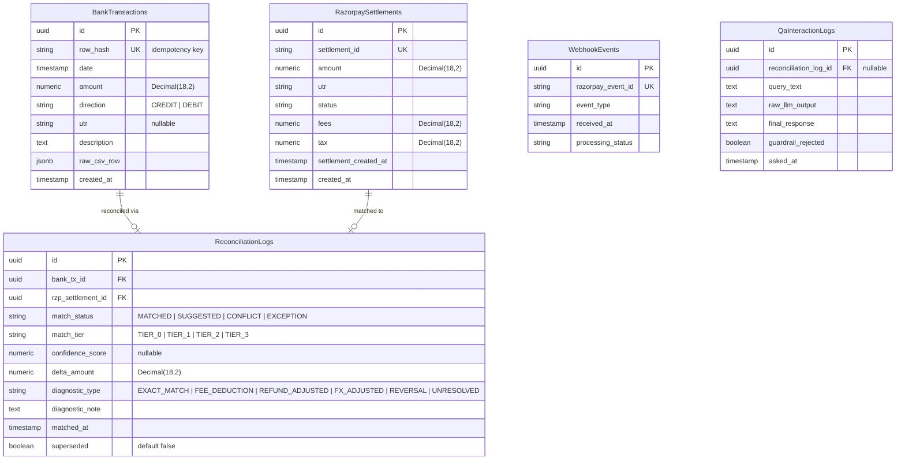

# 🏗️ Architecture — ReconGrid AI

> **Stack:** Python 3.11+ / FastAPI / Pydantic v2 / SQLAlchemy (async) / PostgreSQL  
> **Frontend:** Next.js 14 / React 18 / Tailwind CSS / TypeScript  
> **Razorpay:** Called via `httpx` against the REST API — no Node SDK

---

## 1. How Data Flows Through the System

Here's the big picture — what happens from the moment a CSV is uploaded to the moment a user sees their reconciliation results:

```
[ Frontend: Next.js + Tailwind ]
         |
         |  1. Upload Bank Statement CSV (multipart/form-data)
         v
[ FastAPI: /api/v1/bank/upload ]
         |
         |  2. Stream-parse + sanitize → canonical BankTransaction records
         v
[ PostgreSQL ] <-------------------------------------------+
         ^                                                  |
         |  3. Fetch settlements/refunds (paginated, backoff)
         |                                                  |
[ Razorpay Fetcher (httpx + tenacity retry) ]              |
         ^                                                  |
         |  3b. Real-time settlement.processed webhook      |
[ FastAPI: /api/v1/webhooks/razorpay ] (HMAC-verified)     |
         |                                                  |
         |  4. Load Bank + Razorpay datasets                |
         v                                                  |
[ Reconciliation Engine (deterministic, Decimal-based) ] ---+
         |                                 5. Write matches/exceptions/diagnostics
         |  6. Serve reconciled data
         v
[ FastAPI: /api/v1/reconciliation/* ] --> [ Next.js Dashboard ]
```

---

## 2. Components — What Each Piece Does

### 2.1 Ingestion Service — `app/services/ingestion.py`

**Job:** Take a raw bank CSV and turn it into clean, deduplicated records.

What it does:
- **Streams** CSVs row-by-row (never loads the full file into memory) with auto-detection of delimiters and headers
- **Normalizes** each row into a standard shape: `date`, `amount` (Decimal), `utr`, `direction` (CREDIT/DEBIT), `description`, plus the original raw row as JSON
- **Deduplicates** using a SHA-256 hash of `date|amount|utr|raw_row` — uploading the same statement twice is harmless
- **Rejects** bad files early: wrong MIME type or oversized → structured `400` error, never a silent partial ingest

### 2.2 Razorpay Fetcher — `app/services/razorpay_client.py`

**Job:** Get settlement and refund data from Razorpay, reliably.

What it does:
- Calls `GET /v1/settlements` and `GET /v1/refunds` with cursor pagination (`count=100`, loop until done)
- Retries with exponential backoff + jitter via `tenacity` — **hard ceiling of 5 attempts**, then raises `RazorpayFetchExhausted` and stops the job loudly (never loops forever)
- **Upserts** by `settlement_id` — safe to re-run after an interruption
- Webhook endpoint verifies `X-Razorpay-Signature` via HMAC-SHA256 on the **raw body** *before* any JSON parsing — invalid signature = `400`, logged, dropped
- Duplicate webhook deliveries are caught by a `event_id` unique constraint — re-delivered events get a `200` but produce no side effects

### 2.3 Reconciliation Engine — `app/services/reconciliation.py`

**Job:** Match bank rows to Razorpay settlements. **No AI here — pure deterministic rules on Decimal values.**

The matching runs in tiers, from strongest to weakest evidence:

| Tier | What It Checks | Result If It Matches |
|---|---|---|
| **Tier 1** (Exact) | `utr == utr` AND `amount == amount` | `MATCHED` ✅ |
| **Tier 0** (Fallback) | Date window ±2 days + exact amount (used when UTR is missing) | `SUGGESTED` — needs human approval |
| **Tier 2** (Fuzzy) | Levenshtein/Jaro-Winkler similarity ≥ 90% on descriptor text | `SUGGESTED` — needs human review |
| **Tier 3** (Diagnostics) | Delta explained by: fees + 18% GST? Refund batch? FX adjustment? | Explained → diagnostic logged • Unexplained → `EXCEPTION` ❌ |

**Conflict rule:** If one settlement matches multiple bank rows → both locked as `CONFLICT` until a human picks one. No "first match wins" — that's a bug, not a feature.

All money uses `Decimal`. All comparisons at `Decimal` precision. No floats anywhere.

### 2.4 Settlement Q&A Agent — `app/services/settlement_qa.py`

**Job:** Answer plain-language questions about reconciliation results. This is a **narration layer**, not a decision layer.

How it works:
1. User asks something like *"Why didn't order #4521 settle correctly?"*
2. **Retrieval (deterministic):** Look up the matching `ReconciliationLog` row by order ID / UTR / settlement ID — no LLM involved
3. **Narration (LLM):** Pass the row's data (diagnostic type, delta, notes) to an LLM with a strict prompt: *"Explain this in plain language for a non-technical CA — do NOT recalculate or invent numbers"*
4. **Guardrail:** Extract every number from the LLM's response and check against the source row. Any invented number → reject the response, show a template fallback instead
5. If no record found → deterministic *"No record found for this reference"* — never a fabricated answer

### 2.5 Audit Log — `app/models/reconciliation_log.py`

**Job:** Make every decision permanently traceable.

Each row stores: input record IDs, which tier matched, confidence score, computed delta, diagnostic type, and timestamp.

**Critical rule:** Rows are **never updated or deleted**. A correction is a new row pointing back to the one it supersedes. Full history preserved forever — this is an audit tool.

Q&A interactions are also logged in `QaInteractionLog` — query text, source record, LLM output, whether the guardrail rejected it. The Q&A layer is auditable too.

### 2.6 Frontend — Next.js Dashboard

The user-facing layer:
- Side-by-side reconciliation ledger with color-coded status badges
- One-click approve/deny on `SUGGESTED` matches
- Real-time match-rate and exception metrics
- Export to CSV/JSON
- Settlement Q&A chat panel ([detailed wireframes →](./UX-CONTEXT.md))

---

## 3. Database Schema



---

## 4. Security Boundaries

| What | How It's Protected |
|---|---|
| Razorpay secrets | Backend `.env` only — never referenced in frontend |
| Webhook verification | HMAC-SHA256 on raw bytes, `hmac.compare_digest` (constant-time), runs before route body parsing |
| Duplicate webhooks | Deduped by `event.id` unique constraint |
| CSV injection | MIME/size validated before parsing, no `eval`, streamed with bounded memory |
| Money precision | `Decimal`-only via Pydantic `condecimal` — floats rejected at the schema boundary |
| LLM output | Guardrailed against source row — invented numbers are rejected, interaction logged |

---

## 5. Rate Limiting, Pagination & Failure Recovery

- **Pagination:** Cursor/offset loop (`count=100, skip=N`) until no more results
- **Backoff:** `tenacity` exponential backoff + jitter on `429`/`5xx`, max 5 attempts, then hard-stop with `RazorpayFetchExhausted`
- **Concurrency throttle:** `asyncio.Semaphore` limits parallel Razorpay calls to avoid quota exhaustion
- **Circuit breaker:** After N consecutive failures, jobs pause for a cooldown before retrying

---

## 6. API Endpoints

All routes under `/api/v1` — see the [full API reference in the README](./README.md#-api-reference).

---

## 7. Edge Cases Explicitly Handled

1. **Split/batched settlements** — Tier 3 groups settlements by date window and compares summed amounts before declaring `EXCEPTION`
2. **Missing/non-standard UTR** — Tier 0 fallback engages automatically; result is always `SUGGESTED`, never auto-`MATCHED` (weaker evidence)
3. **Duplicate/out-of-order webhooks** — Deduped by `event_id`; matching logic handles settlements arriving before bank data (creates `PENDING_BANK_DATA` state, not a false exception)
