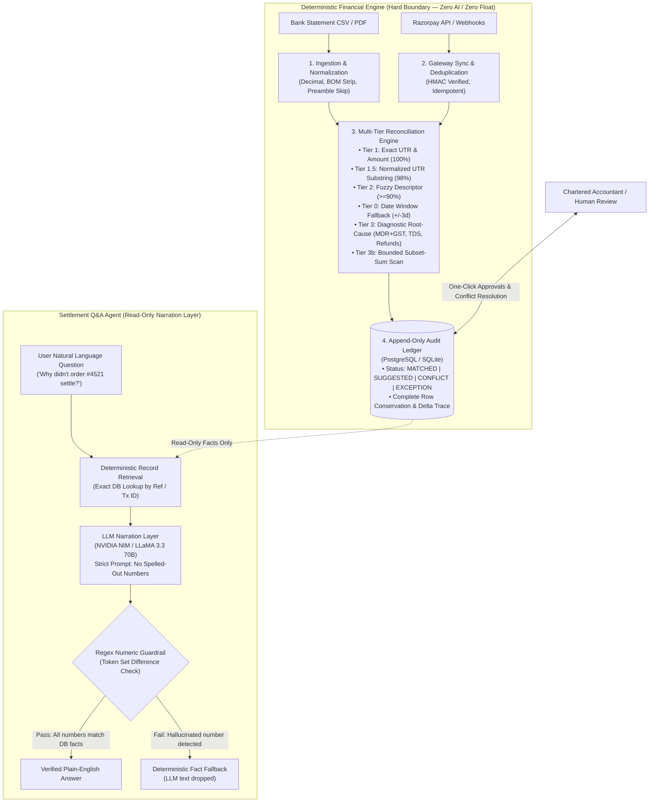

# 🎯 Project Overview — ReconGrid AI

## 1. What Is ReconGrid AI?

**ReconGrid AI** is a settlement reconciliation and discrepancy-diagnostic engine built for finance teams using Razorpay — especially B2B SaaS companies and high-volume D2C brands.

Every time you run it, it gives you three clear, verifiable things:

1. **Automated Match Rate %** — how much was resolved automatically (`(matched + approved suggested) ÷ total records`)
2. **Total ₹ Reconciled** — the exact amount reconciled, with an audit trail back to every source row
3. **An Honest Exception List** — every single row that couldn't be resolved, verbatim, with a reason code

This is a **verification and audit tool first**. AI is used only for plain-English explanations of already-computed facts — never for math, matching, or financial decisions.

---

## 2. Why This Problem Matters

Talk to any SME founder, finance lead, or Chartered Accountant handling Razorpay, and they'll tell you the same things:

* **Excel Gridlock:** They spend 15–30 hours every month manually comparing bank UTRs against Razorpay payout reports across hundreds or thousands of rows.
* **The Math Is Never Simple:** Settlement amounts rarely match gross transaction amounts. Platform fees, 18% GST, mid-cycle refunds, chargebacks, and gateway reserves all create deltas that have to be figured out one by one.
* **Human Error & Delayed Closes:** Doing this manually leads to missed discrepancies, unlocated funds, and delayed month-end closes.
* **Data Silos:** Bank statement formats vary wildly (HDFC, ICICI, SBI, Axis all format differently), and they don't talk to payment gateway logs.

---

## 3. How ReconGrid AI Solves It

ReconGrid AI enforces a strict architectural boundary: **Deterministic code makes every financial decision; AI is used solely for read-only explanation behind an anti-hallucination guardrail.**

1. **Ingest & Normalize:** Parses bank CSVs and multi-page PDFs into standard records (`date`, `amount`, `utr`, `direction`), with UTF-8 BOM stripping, preamble header detection, and unscaled paise protection.
2. **Sync Settlements:** Pulls settlements and refunds via Razorpay's REST API (cursor-paginated, with backoff) and listens for real-time webhooks (HMAC-verified, idempotent).
3. **Multi-Tier Matching Engine:**
   - **Tier 1 (Exact):** UTR match + exact net amount match → `MATCHED` (100% confidence)
   - **Tier 1.5 (Normalized UTR):** UTR prefix/suffix match (≥6 chars entropy) → `SUGGESTED` (98% confidence)
   - **Tier 2 (Fuzzy):** Descriptor string similarity (≥90%) → `SUGGESTED` (human reviews)
   - **Tier 0 (Fallback):** Date window (±3 days) + exact amount → `SUGGESTED` (human approves)
   - **Tier 3 (Diagnostics & Subset Sum):** Explains deltas (fees + GST, Section 194-O TDS, refund clawbacks, FX adjustments) or groups batched payouts via two-pointer subset sum.
4. **Audit & Exception Reporting:** Every decision is written to an append-only log. Every record ends in a clear state (`MATCHED`, `SUGGESTED`, `CONFLICT`, or `EXCEPTION`).
5. **Settlement Q&A Agent:** Finance users can ask questions in plain English (*"Why didn't order #4521 settle correctly?"*). The system retrieves the exact audit record, has the LLM explain it in plain language, and runs an anti-hallucination regex guardrail to ensure zero invented numbers.

---

## 4. When the System Stops & Asks a Human

The engine **never guesses**. It stops and asks for human review whenever:

- A discrepancy can't be explained by fees + GST, refund batching, or FX within the ±₹1.00 tolerance
- A fuzzy match confidence is below 90%
- One settlement matches more than one bank row (conflict — locked until resolved)
- A webhook fails signature verification (rejected immediately, logged)
- Razorpay API retries exceed 5 attempts (halts and alerts rather than looping forever)

---

## 5. What We'll Show the Judges

| Output | What It Proves |
|---|---|
| **Match rate %** on 50+ record synthetic batch | Meets the Track 04 hackathon requirement (96.00% automated match rate on 50-row batch) |
| **Total ₹ reconciled vs. ingested** | Shows the financial scale handled with zero-float Decimal mathematical conservation |
| **Unedited exception list** | Proves the tool is honest and doesn't sweep errors under the rug (e.g. 2 seeded anomalies totaling ₹99,998) |
| **High-throughput batch processing** | Sub-second execution across 50, 200, 500, and 1,000 transaction batches |
| **End-to-end audit trail** | Shows one record traced: raw CSV row → matched settlement → diagnostic → log entry |
| **Q&A Agent demo** | Shows the plain-English explanation layer working with strict anti-hallucination numeric guardrails |

### Measured Batch Processing Benchmarks

Tested with `python backend/scripts/benchmark_throughput.py` on the full multi-tier reconciliation engine and database audit ledger:

| Batch Size | Wall Time | Throughput (Rows/Sec) | Peak RAM | Match Rate % | Unresolved Exceptions (INR) | Conservation |
|:---:|:---:|:---:|:---:|:---:|:---:|:---:|
| **50** | `0.0351s` | **1,424.5 rows/s** | 1.52 MB | 96.00% | 2 (₹ 99,998.00) | PASSED (0 lost) |
| **200** | `0.1078s` | **1,855.3 rows/s** | 2.68 MB | 95.00% | 10 (₹ 499,990.00) | PASSED (0 lost) |
| **500** | `0.3136s` | **1,594.4 rows/s** | 6.49 MB | 94.80% | 9 (₹ 449,991.00) | PASSED (0 lost) |
| **1,000** | `0.9716s` | **1,029.2 rows/s** | 12.88 MB | 94.80% | 17 (₹ 849,983.00) | PASSED (0 lost) |
| **5,000** | `32.6310s` | **153.2 rows/s** | 67.50 MB | 94.72% | 13 (₹ 649,987.00) | PASSED (0 lost) |

---

## 6. Who This Is For

- **SME Founders & Finance Ops:** Need payout and fee visibility without hiring a dedicated reconciliation team
- **Chartered Accountants & Accounting Firms:** Manage multi-client month-end closes and need GST input-tax-credit verification
- **D2C & E-Commerce Brands:** High daily transaction volumes, frequent chargebacks, instant refunds

---

## 7. Out of Scope for v1 (Keeping It Honest)

To keep the scope realistic for a 14-day buildathon:
- ❌ Multi-bank-account netting/consolidation across different accounts
- ❌ Non-INR settlement currencies beyond basic FX-delta detection
- ❌ Direct GST filing/e-invoicing (we do diagnostics, not filing)
- ❌ Multi-gateway support (Razorpay only for v1)

**Compliance & PCI Scope:** ReconGrid processes settlement metadata (amounts, UTRs, dates) and never touches card numbers, CVVs, or other PCI-scoped data, so PCI-DSS does not apply.

---

## 8. Real-World Edge Cases Handled

1. **Split / Batched Settlements:** A bank credit might bundle multiple Razorpay settlements, or a large settlement might be split across two days. The engine groups candidate settlements by date-window + summed amount before declaring an exception.
2. **Settlement Reversals:** Razorpay sometimes debits an account days after settlement (chargeback, hold reversal). The bank statement shows a debit, not a credit. Ingestion explicitly tracks `CREDIT` vs `DEBIT` rather than assuming everything is a credit.
3. **Cross-Currency Settlements:** Foreign transactions have an FX component on top of fees + GST. Tier 3 includes an FX-adjustment check before falling back to unresolved.
