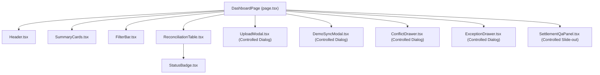
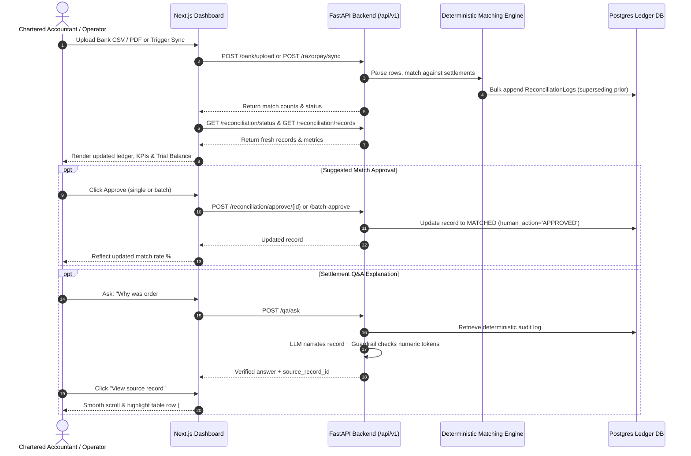

# Technical Architecture Map: Razorpay ReconGrid AI

## 1. Stack Overview

### Frontend
- **Framework**: Next.js 14.2.3 (App Router, React 18.3.1)
- **Language**: TypeScript 5.4.5 (Strict Mode)
- **Styling**: Tailwind CSS 3.4.3, custom utility classes (`.font-tabular`, `.financial-surface`, `.citation-highlight`)
- **Icons**: Lucide React 0.363.0
- **Build/Runtime**: Node.js 18+, Next.js standalone server

### Backend (Reference Only - Fixed Production Contracts)
- **Framework**: FastAPI (Python 3.11 / Uvicorn async worker)
- **ORM / Database**: SQLAlchemy 2.0 Async, PostgreSQL (production) / SQLite (development)
- **Reconciliation Engine**: 100% Deterministic Python Decimal arithmetic (zero float, zero LLM in matching pipeline)
- **Diagnostic Engine**: Exact rules for 2% MDR fee + 18% GST, 1% Section 194-O TDS, batched payouts (subset-sum), refunds, FX deltas, and reversals
- **AI Explanations**: LLaMA 3.3 70B (via NVIDIA NIM) behind strict regex-based numeric token guardrail (`backend/app/services/guardrail.py`)

---

## 2. Frontend Directory Structure

```
frontend/
├── package.json
├── tsconfig.json
├── tailwind.config.ts
├── postcss.config.mjs
├── public/
└── src/
    ├── app/
    │   ├── globals.css          # Tabular numbers, custom scrollbars, keyframe animations
    │   ├── layout.tsx           # Root HTML wrapper with dark theme & typography
    │   └── page.tsx             # Monolithic Dashboard view & central state orchestrator
    ├── components/
    │   ├── ConflictDrawer.tsx   # Multi-candidate conflict resolution modal
    │   ├── DemoSyncModal.tsx    # Synthetic test data seeder & Razorpay REST API sync trigger
    │   ├── ExceptionDrawer.tsx  # Forensic audit inspector (raw Bank CSV & Razorpay JSON)
    │   ├── FilterBar.tsx        # Tab filters, search, diagnostic dropdown, batch approval
    │   ├── Header.tsx           # Top navigation bar, bank account selector, global actions
    │   ├── ReconciliationTable.tsx # Ledger data grid with status badges & CA action buttons
    │   ├── SettlementQaPanel.tsx   # Slide-out AI settlement Q&A assistant with session memory
    │   ├── StatusBadge.tsx      # Match status badge with hover tooltip diagnostic
    │   ├── SummaryCards.tsx     # 4-column KPI cards and Trial Balance control strip
    │   └── UploadModal.tsx      # Statement upload dialog (PDF/CSV) with password guide
    └── lib/
        ├── api.ts               # Typed client interfacing with backend REST API
        ├── formatters.ts        # Currency (₹ INR), date, time, and accounting fee formatters
        └── types.ts             # Domain TypeScript definitions
```

---

## 3. State Management & Component Tree

### Current State Hierarchy



### State Variables in `page.tsx`
- **Core Domain State**:
  - `status: ReconciliationStatus | null`: Aggregated batch KPIs (total records, match rate, amounts, counts).
  - `records: ReconciliationRecordItem[]`: Filtered list of reconciliation ledger records.
  - `loading: boolean`: Table and page-level loading spinner indicator.
- **Filter & Search State**:
  - `activeTab: string` (`ALL` | `MATCHED` | `SUGGESTED` | `CONFLICT` | `EXCEPTION`): Primary status filter.
  - `selectedDiagnostic: string` (`ALL` | `FEE_DEDUCTION` | `TDS_194O_DEDUCTION` | etc.): Secondary diagnostic filter.
  - `searchQuery: string`: Text search string for UTR, settlement ID, order ID, and bank narrative.
  - `selectedBank: string` (`ALL` | `HDFC` | `ICICI` | `SBI` | `AXIS`): Mock bank account filter.
- **Interactive UI State**:
  - `isUploadOpen: boolean`: Toggle for bank statement upload dialog.
  - `isSyncOpen: boolean`: Toggle for Razorpay sync & synthetic seeder dialog.
  - `isQaOpen: boolean`: Toggle for Settlement Q&A side panel.
  - `conflictTarget: ReconciliationRecordItem | null`: Active record opened in Conflict resolution drawer.
  - `exceptionTarget: ReconciliationRecordItem | null`: Active record opened in Forensic Exception drawer.
  - `highlightedRecordId: string | null`: Target record highlighted when jumped from Q&A citation.
  - `batchApproveLoading: boolean`: Loading state during bulk approval of suggestions.

---

## 4. API Contracts & Backend Integration

All frontend API calls are routed to `http://localhost:8000/api/v1` via `frontend/src/lib/api.ts`:

| Method | Endpoint | Description | Payload / Query Params | Response Type |
|---|---|---|---|---|
| `GET` | `/reconciliation/status` | Aggregated reconciliation stats | `batch_id?: string` | `ReconciliationStatus` |
| `GET` | `/reconciliation/records` | Filtered reconciliation ledger records | `status?: string`, `diagnostic?: string`, `search?: string`, `limit?: number` | `ReconciliationRecordItem[]` |
| `POST` | `/reconciliation/approve/{id}` | CA approve suggested match | None | `ReconciliationRecordItem` |
| `POST` | `/reconciliation/deny/{id}` | CA deny suggestion → exception | None | `ReconciliationRecordItem` |
| `POST` | `/reconciliation/batch-approve` | Bulk approve suggestions (confidence ≥ 0.90) | None | `{ approved_count: number }` |
| `POST` | `/reconciliation/resolve-conflict` | Resolve multi-candidate conflict | `{ record_id: string, chosen_settlement_id: string, note?: string }` | `{ status: string, resolved_record: ..., displaced_records: [...] }` |
| `POST` | `/bank/upload` | Ingest bank statement CSV/PDF | `FormData` (`file`, `batch_id`, `password`) | `BankUploadResponse` |
| `GET` | `/bank/password-hints` | Bank password formula cheat sheet | None | `BankPasswordHint[]` |
| `POST` | `/razorpay/sync` | Trigger REST sync & auto-matching | `count?: number` | `RazorpaySyncResponse` |
| `POST` | `/demo/seed` | Seed 60 golden test records | `count?: number` | `SeedDemoResponse` |
| `POST` | `/qa/ask` | Ask Q&A agent with numeric guardrail | `{ query: string, context_record_id?: string, history?: [...] }` | `QaAskResponse` |
| `GET` | `/qa/history` | Audit log of past Q&A queries | `limit?: number` | `QaHistoryItem[]` |
| `GET` | `/reconciliation/export/csv` | Download complete CA audit CSV | `batch_id?: string` | Direct CSV File Download |
| `GET` | `/reconciliation/export/text` | Download summary text scorecard | `batch_id?: string` | Plaintext Report |
| `GET` | `/demo/sample-statement` | Download sample bank statement | `bank: HDFC \| ICICI \| SBI` | CSV File Download |

---

## 5. Data Flow & Event Lifecycle



---

## 6. Frontend Architectural Assessment

### Strengths
1. **Zero Math Drift**: All financial figures are string-formatted directly from backend Decimal representations, preventing IEEE-754 floating-point inaccuracies on the client.
2. **Tabular Numerals**: The CSS layer correctly enforces `font-variant-numeric: tabular-nums` (`.font-tabular`), ensuring financial figures align cleanly across vertical columns.
3. **Deep Domain Alignment**: The interface natively accommodates Indian banking terminology (UTR, IMPS/NEFT/RTGS, GST 18%, Section 194-O TDS, CR/DR conventions).

### Bottlenecks & Code Smells
1. **Single-File Monolithic Page**: `page.tsx` holds 11 distinct state variables, manages keyboard listeners, coordinates 5 separate modals/drawers, and performs imperative data fetching inside a single `useEffect`.
2. **Prop Drilling & Inconsistent Modal Patterns**: Conflict and Exception inspectors are called "Drawers" in filename but rendered as centered modal popups (`fixed inset-0 flex items-center justify-center`). Meanwhile, `SettlementQaPanel` is rendered as a right-hand slide-out drawer.
3. **No Optimistic UI Updates**: Approving or denying a suggestion triggers a full refetch (`fetchData()`), creating unnecessary network roundtrips and jarring table flickers.
4. **Missing Empty & Error Boundaries**: When API requests fail (e.g. backend offline), the page fails silently or shows an alert with no structured error recovery card or offline state.
5. **Absence of Dedicated Tab Views**: Period close, GST ITC reconciliation, and high-volume exception queues are cram-packed into a single table view without purpose-built workflows for month-end close.
