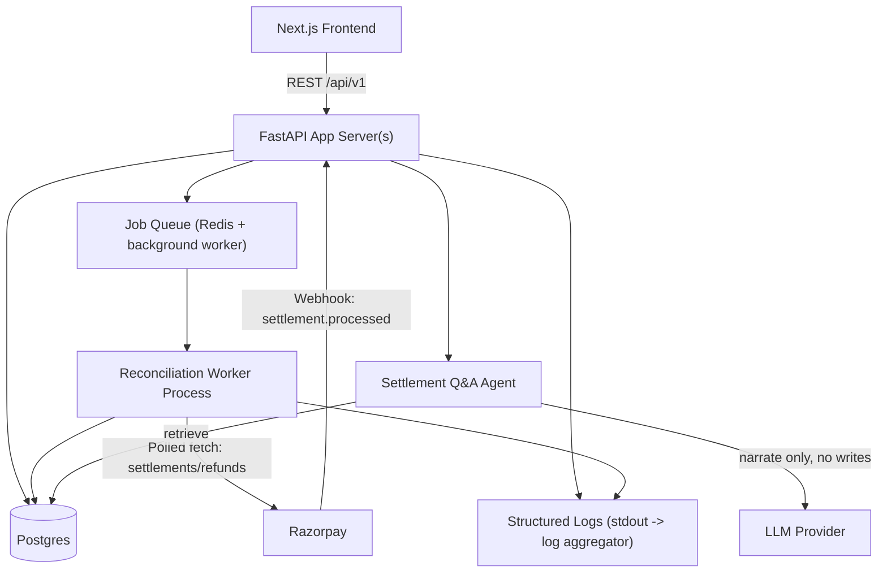
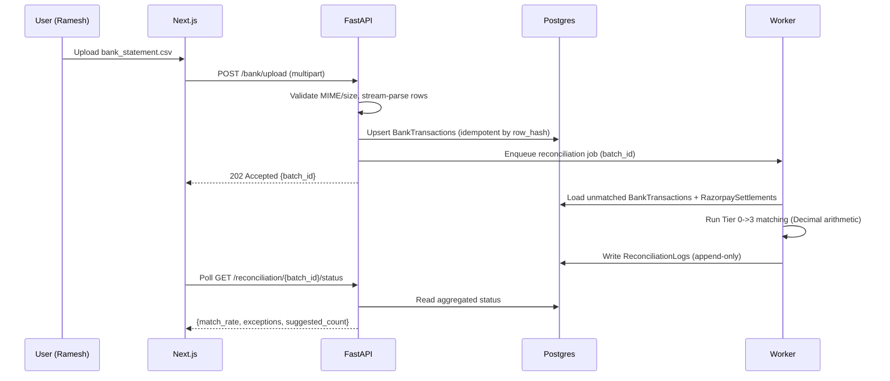
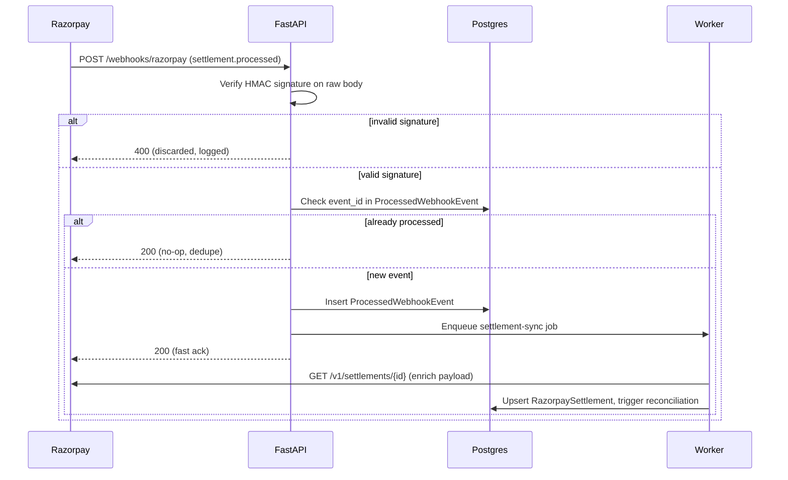
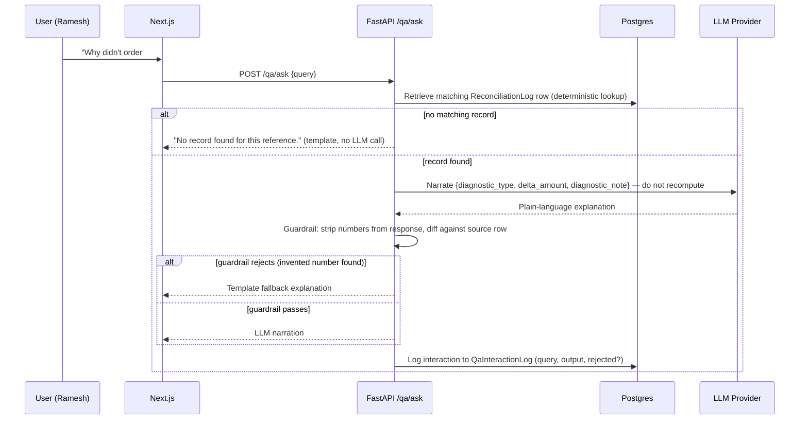
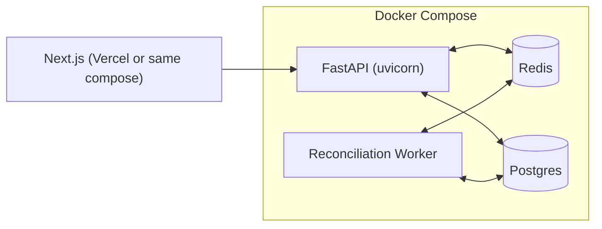

# ReconGrid AI — System Design

## 1. Functional Requirements
1. Ingest bank statement CSVs and normalize into canonical transactions.
2. Fetch and store Razorpay settlements/refunds; consume real-time webhooks.
3. Run deterministic multi-tier matching and produce: `MATCHED`, `SUGGESTED`, `CONFLICT`, `EXCEPTION` for every record.
4. Provide human-in-the-loop approval for `SUGGESTED`/`CONFLICT` records.
5. Produce an immutable audit trail and exportable reports.

## 2. Non-Functional Requirements
| Attribute | Target | Rationale |
|---|---|---|
| Correctness | 100% deterministic reproducibility — same inputs always produce the same match/exception decision | This is a financial audit tool; non-determinism is disqualifying |
| Availability | Best-effort for hackathon (single region); design must not *architecturally* block later multi-instance deployment | Judges evaluate design intent, not uptime SLAs |
| Latency | CSV batch of 1,000 rows reconciles in <30s; webhook endpoint acknowledges in <500ms | Fast-ack webhook is required for Razorpay's retry behavior; batch latency matters for the live demo |
| Consistency | Strong consistency on `ReconciliationLogs` writes (single Postgres instance, transactional) | Cannot have two reconciliation runs disagree on a settled record |
| Auditability | Every decision traceable to its inputs, forever, without mutation | Core product promise |

## 3. Capacity Estimation
* **Hackathon demo scale**: 50–2,000 transactions/batch (Track 04 minimum is 50).
* **Design target (stated, not necessarily built)**: 50,000 transactions/day per merchant — sized so a single Postgres instance with proper indexing (on `utr`, `settlement_id`, `date`) handles it without a re-architecture, deferring horizontal scaling to "add read replicas + queue workers," not "rewrite the matching engine."

## 4. High-Level Component Diagram

**Why a queue instead of doing reconciliation inline in the request handler**: webhook handlers must ack in <500ms (§2), but a full reconciliation run against a large batch can take seconds. The webhook route verifies signature + dedupes + enqueues a job, then returns `200` immediately. The actual matching runs asynchronously in a worker. This is also what makes retries safe — the fast path is idempotent and side-effect-free beyond "job enqueued."

## 5. Sequence: CSV Upload → Reconciliation

## 6. Sequence: Webhook Ingestion

## 7. Sequence: Settlement Q&A Agent

## 8. Failure Mode & Recovery Matrix
| Failure | Detection | Recovery |
|---|---|---|
| Razorpay API down/timeout | `httpx` timeout / 5xx | Retry w/ backoff, ceiling 5, then job → `FAILED`, operator alert (not silent) |
| Webhook signature invalid | HMAC mismatch | Reject `400`, log, no state change |
| Duplicate webhook delivery | `event_id` already in `ProcessedWebhookEvent` | Ack `200`, no-op |
| Worker crashes mid-batch | Job stuck in `PROCESSING` past a timeout threshold | Reaper task requeues jobs stuck >N minutes |
| Two bank rows match one settlement | Matching engine detects >1 candidate | Both marked `CONFLICT`, locked pending manual merge |
| CSV malformed mid-file | Row-level parse exception | Row-level `EXCEPTION` with raw text preserved; rest of file continues (partial failure, not whole-file failure) |
| DB write fails on log insert | Transaction exception | Whole reconciliation decision for that record rolled back — never a match applied without its audit log row (single transaction) |

## 9. Observability
* **Structured logs** (`structlog`, JSON) — every service call logs `event`, `batch_id`/`event_id`, `duration_ms`, `outcome`.
* **Metrics to expose** (even as a simple `/metrics` counter dict for the hackathon, Prometheus-shaped for real use): `reconciliation_match_rate`, `exceptions_total`, `webhook_signature_failures_total`, `razorpay_fetch_retries_total`, `webhook_ack_latency_ms`.
* **Tracing (stretch)**: correlate a `batch_id` across upload → worker → log rows so a judge can be shown one request's full path.

## 10. Security Threat Model (abbreviated STRIDE)
| Threat | Mitigation |
|---|---|
| Spoofed webhook (Spoofing) | HMAC-SHA256 verification, constant-time compare |
| Replayed webhook (Repudiation/Tampering) | Event-ID dedupe table |
| CSV injection / malicious payload (Tampering) | MIME/size validation, no formula execution, streamed parsing with bounded memory |
| Secret leakage (Information Disclosure) | Env vars only, `.gitignore` enforced, PR diff check per `WORKFLOW-RULES.md` |
| Runaway retry loop exhausting quota (Denial of Service, self-inflicted) | Hard retry ceiling + circuit breaker |

## 11. Deployment Architecture (Hackathon-Scoped)

Single `docker-compose.yml` running API, worker, Redis, and Postgres is sufficient for judging — the design above (§4) is what justifies calling this "horizontally scalable" in the write-up without actually needing to deploy that way in 14 days.

## 12. Explicit Design Trade-offs (for the write-up)
* **Chose Postgres over a NoSQL store**: reconciliation requires relational joins (bank ↔ settlement ↔ log) and strong transactional guarantees on money — not a fit for eventual consistency.
* **Chose a queue over pure synchronous processing**: required by Razorpay's webhook ack-time expectations (§4), not a scalability flex.
* **Chose deterministic rules over an LLM for matching**: matching money is a correctness problem with a known-correct answer; an LLM adds nondeterminism and cost with no accuracy benefit here — reserved instead for optional plain-language narration of an already-computed diagnostic.
* **Chose retrieval-then-narrate over letting the LLM query the database directly**: the Q&A Agent (§7) never has write access and never runs its own lookups — a deterministic repository query fetches the exact `ReconciliationLog` row first, and the LLM only rephrases fields already in that row. This keeps every Q&A answer traceable to one specific, already-audited record instead of trusting the model to retrieve correctly.
