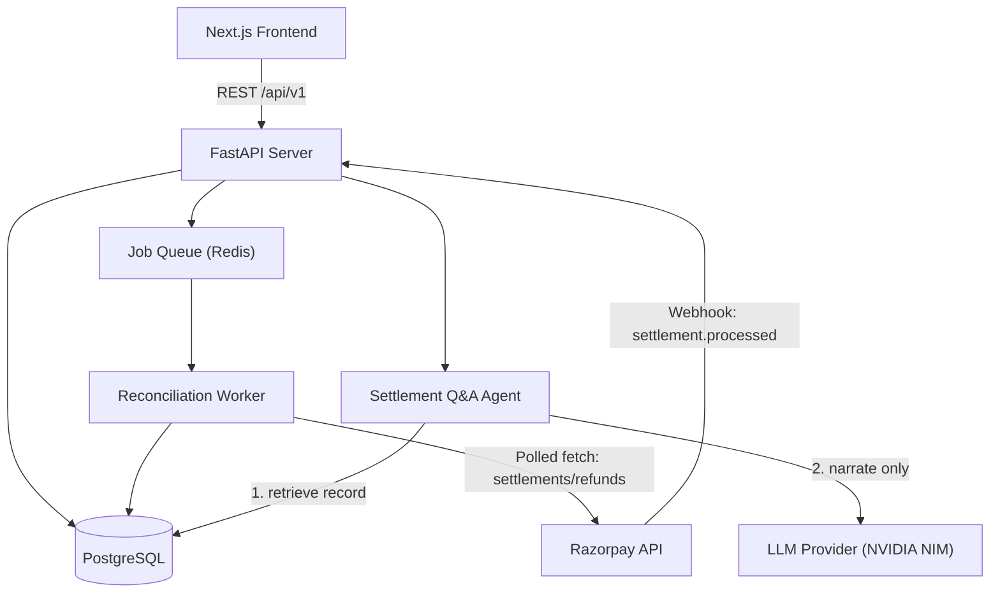
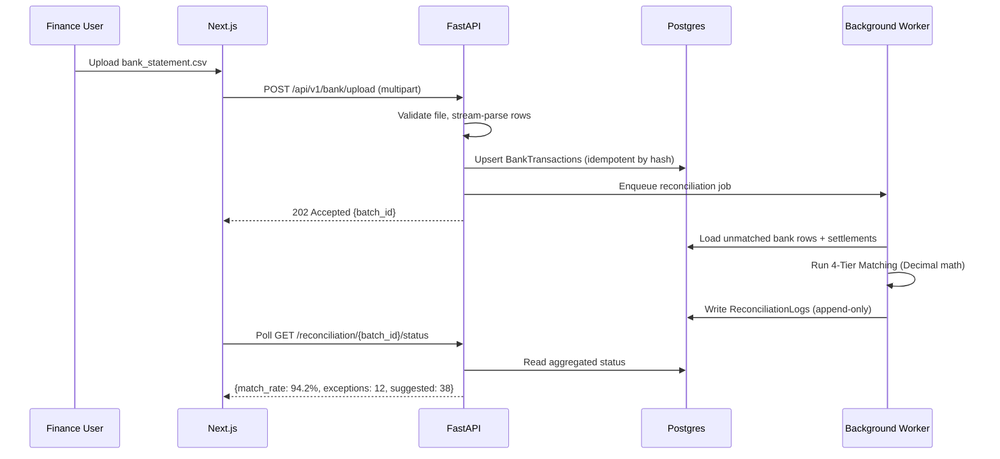
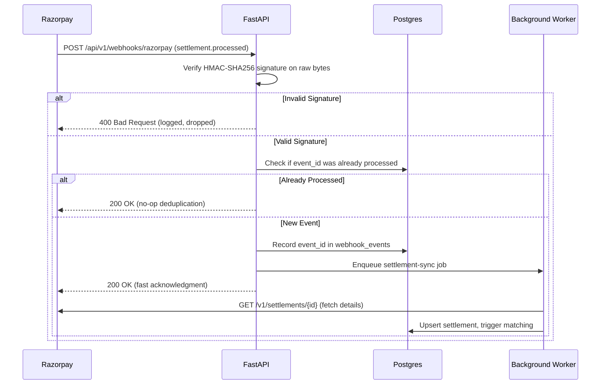
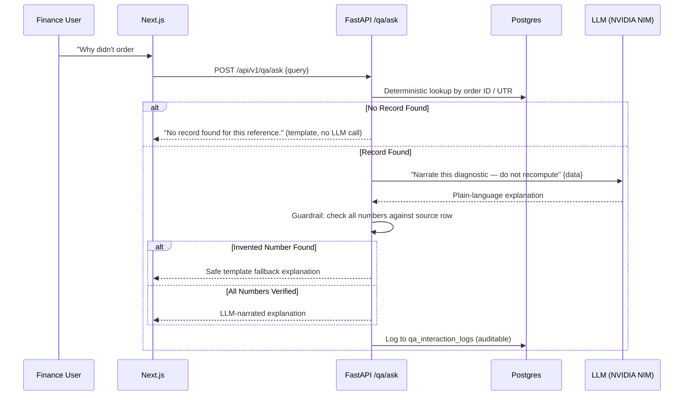

# ⚙️ System Design — ReconGrid AI

---

## 1. Requirements

### Functional Requirements
1. Ingest bank statement CSVs and normalize them into standard transactions
2. Fetch and store Razorpay settlements and refunds; handle real-time webhooks
3. Run deterministic 4-tier matching to categorize every record as `MATCHED`, `SUGGESTED`, `CONFLICT`, or `EXCEPTION`
4. Provide human-in-the-loop review for suggested matches and conflicts
5. Maintain an append-only, superseded-not-deleted audit trail and support CSV/JSON exports
6. Provide a natural-language Q&A agent that explains reconciliation results with strict numeric guardrails

### Non-Functional Requirements
| Attribute | Target | Why It Matters |
|---|---|---|
| **Correctness** | 100% deterministic — same input always yields same output | This is a financial tool; non-determinism is unacceptable |
| **Batch Latency** | 1,000 CSV rows reconcile in < 30 seconds | Fast enough for live demo and real-world usage |
| **Webhook Latency** | Acknowledge in < 500ms | Razorpay retries aggressively if webhooks aren't acked fast |
| **Consistency** | Strong consistency on audit logs (Postgres transactional writes) | Two runs must never disagree on a settled record |
| **Auditability** | Every decision traceable back to source rows, forever | Core product promise |

---

## 2. Capacity & Sizing

- **Hackathon Demo:** 50–2,000 transactions per batch (Track 04 requires ≥50)
- **Target Scale:** 50,000 transactions/day per merchant — easily handled by a single Postgres instance with proper indexes on `utr`, `settlement_id`, and `date`

---

## 3. High-Level Architecture

### Why a Queue for Reconciliation?
Razorpay expects webhooks to be acknowledged in under 500ms. A full reconciliation run across a large batch can take several seconds. So:
1. The webhook route verifies the signature, dedupes, enqueues the job, and returns `200` immediately.
2. The actual matching runs asynchronously in the worker.
3. This makes retries safe — the fast path is completely idempotent.

---

## 4. Sequence Diagrams

### Flow 1: CSV Upload → Reconciliation

### Flow 2: Razorpay Webhook Ingestion

### Flow 3: Settlement Q&A Agent

---

## 5. Failure Modes & How We Recover

| Failure | How It's Detected | How It Recovers |
|---|---|---|
| **Razorpay API down** | `httpx` timeout / 5xx error | Retries with exponential backoff (max 5), then marks job `FAILED` and alerts operator |
| **Invalid webhook signature** | HMAC check fails | Returns `400`, logs the attempt, makes no database changes |
| **Duplicate webhook** | `event_id` already in DB | Returns `200` immediately without re-processing |
| **Worker crashes mid-batch** | Job stuck in `PROCESSING` | Reaper task detects timed-out jobs and re-queues them |
| **Two bank rows match one settlement** | Engine finds >1 candidate | Both marked `CONFLICT` (confidence 0.50). Allocating to one bank row automatically displaces competing rows to `EXCEPTION` (`AUTO_DISPLACED`) |
| **Malformed row in CSV** | Row-level parse exception | That row gets an `EXCEPTION` with raw text preserved; rest of file continues |
| **DB write fails on log insert** | Transaction error | Entire record decision is rolled back — never a match without its audit row |

---

## 6. Key Design Trade-Offs (Why We Built It This Way)

1. **PostgreSQL over NoSQL:** Financial reconciliation is all about relational joins (bank row ↔ settlement ↔ audit log) and ACID transactions. Eventual consistency is a non-starter when money is involved.
2. **Queue over Synchronous Processing:** Razorpay expects webhooks acknowledged in <500ms. Offloading reconciliation to a background worker keeps the API fast and responsive.
3. **Deterministic Rules over LLM Matching:** Matching money has an exact right answer. An LLM would add cost, latency, and hallucination risk with zero accuracy benefit.
4. **Retrieval-First for Q&A:** The LLM never queries the database directly. A deterministic Python query retrieves the exact record, and the LLM only translates that record into plain English. This keeps every answer auditable and hallucination-free.
