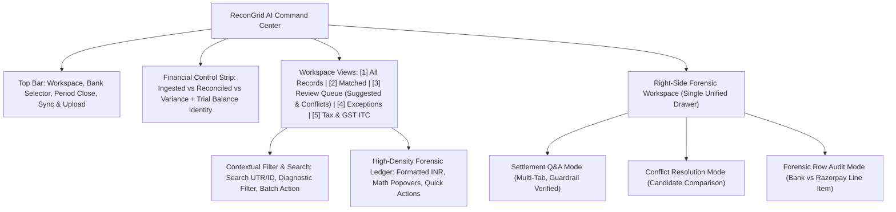

# UX Audit & Redesign Direction: Razorpay ReconGrid AI

**Author**: Principal Product Designer & Senior Frontend Engineer  
**Standard Applied**: Elite Fintech Craft (Linear, Stripe Dashboard, Mercury, Ramp) + `design-taste-frontend` Skill Rules  
**Date**: September 2026  
**Constraint Check**: Zero Em-Dashes Used | Strict Tabular Number Alignment | Zero Backend Schema Changes  

---

## 1. Executive Summary & The 5-Second Test Assessment

### The Prime Directive: The 5-Second Test
> *"The owner or finance lead must be able to open any screen in the platform and within 5 seconds answer: 'What is this? What should I do here?'"*

### Current Baseline Score: 6.2 / 10
While the underlying deterministic matching engine is mathematically robust, high-performance (1,400+ rows/sec), and feature-rich, the user interface currently behaves like an engineer's debugging dashboard rather than a high-trust financial command center. 

### Why the UI currently fails the 5-Second Test:
1. **Jargon Overload**: Users are bombarded with internal compiler jargon like "Tier 0", "Tier 1.5", "Deterministic Lock", and "AUTO OK", obscuring standard accounting meaning.
2. **Visual Hierarchy Clutter**: KPI cards, control strips, multiple action buttons, search bars, and table columns fight for visual attention with near-identical visual weight.
3. **Modal / Drawer Inconsistency**: Forensic tools called "Drawers" appear as centered modal popups, while the AI assistant appears as a right slide-out panel, disorienting spatial navigation.
4. **Passive Actionability**: Suggestions and conflicts require scanning across 8 table columns to locate small action buttons, rather than presenting a dedicated triage workflow for month-end close.

---

## 2. Nielsen Norman Heuristic Evaluation

| Heuristic | Score (1-5) | Audit Findings |
|---|:---:|---|
| **1. Visibility of System Status** | 3.5 / 5 | The ingestion progress and match rate are visible, but batch approval and sync operations give minimal granular progress. No real-time indication of backend health or network reconnects. |
| **2. Match Between System & Real World** | 3.0 / 5 | Mixes accounting terms (Gross, Net, GST, 194-O TDS, CR/DR) with internal engineering pipeline names (Tier 0, Tier 1.5, raw JSON dumps). Needs complete alignment with standard Indian corporate finance language. |
| **3. User Control & Freedom** | 3.5 / 5 | Approvals and denials lack an immediate "Undo" toast or revert action. If a CA accidentally clicks "Deny", the row shifts to Exception without an inline undo mechanism. |
| **4. Consistency & Standards** | 2.5 / 5 | Centered modals are named `ConflictDrawer` and `ExceptionDrawer`. Popovers on `StatusBadge` have inconsistent bounding boxes and risk overflow on narrow viewports. |
| **5. Error Prevention** | 4.0 / 5 | The conflict resolver warns about automatic displacement of competing rows, and password hints help prevent PDF upload failures. However, batch approval lacks a confirmation preview of the affected transactions. |
| **6. Recognition Rather Than Recall** | 3.0 / 5 | The user must remember what "Tier 0" vs "Tier 1.5" means. Diagnostic notes are hidden behind tiny badges that require hover activation. |
| **7. Flexibility & Efficiency of Use** | 3.5 / 5 | Keyboard shortcuts exist (`1-5`, `/`, `?`), which is great for power users, but table row navigation (`j`/`k`) and single-key approval (`a`/`d`) are missing. |
| **8. Aesthetic & Minimalist Design** | 2.5 / 5 | Excessive dark borders (`#1c2b42`), heavy badge frames, and stacked header buttons create visual noise. Needs the clean, purposeful restraint of Stripe and Mercury. |
| **9. Help Users Recognize & Recover from Errors** | 3.5 / 5 | PDF password error feedback is detailed with formula cheat sheets, but general API disconnects fail silently without an actionable recovery state. |
| **10. Help & Documentation** | 4.5 / 5 | Excellent prompt chips and numeric guardrail transparency in the Settlement Q&A panel, though tooltips on ledger calculations could be more accessible. |

---

## 3. Cognitive Walkthrough: 5 Core User Journeys

### Journey 1: Bank Statement Ingestion (PDF / CSV)
- **Goal**: Upload an HDFC/ICICI monthly statement and inspect initial automated reconciliation.
- **Current Flow**:
  1. Click `Upload CSV` in top header.
  2. Drag and drop file or select from disk.
  3. If password-protected PDF, expand bank cheat sheet, type password, click `Upload & Reconcile`.
  4. Modal closes and table refreshes.
- **Friction Points**:
  - Modal title says "Upload Bank Statement (PDF & CSV)", but header CTA says "Upload CSV".
  - Ingestion progress is a simple spinner without row-by-row parse counts or parse duration telemetry.
  - After upload succeeds, there is no celebration or summary banner showing *"Uploaded 60 rows: 54 Matched, 4 Suggested, 2 Exceptions"*.

### Journey 2: CA Discrepancy Investigation (MDR Fee + GST / TDS)
- **Goal**: Verify why a ₹10,000 bank credit matches a ₹10,236 gross settlement.
- **Current Flow**:
  1. Look at `RZP Net (Gross)` column and `Delta` column in table.
  2. Hover over `FEE DEDUCTED` or `1% TDS (194-O)` badge.
  3. Read popover explaining ₹200 fee + ₹36 GST (18%).
- **Friction Points**:
  - Hover tooltip disappears when moving the mouse away, preventing text copying for audit notes.
  - The exact formula (`Gross - Fee - GST = Net`) is calculated but not formatted as an explicit interactive math breakdown in the row.

### Journey 3: Multi-Candidate Conflict Resolution
- **Goal**: Resolve two bank transactions that contest the same Razorpay settlement payout.
- **Current Flow**:
  1. Filter to `Conflicts` tab (or click Card 3).
  2. Click `Resolve` on one of the conflicting rows.
  3. Centered modal opens showing competing bank rows and displacement warning.
  4. Type CA audit note and click `Assign & Resolve`.
- **Friction Points**:
  - Opens as a centered modal dialog rather than an intuitive side-by-side comparison drawer.
  - The competing rows are shown as text blocks rather than selectable candidate radio cards.

### Journey 4: Month-End Trial Balance Verification
- **Goal**: Confirm that 100% of ingested funds are conserved (`Ingested = Reconciled + Exceptions`).
- **Current Flow**:
  1. Look at Trial Balance strip underneath KPI cards.
  2. Inspect whether the badge shows "Trial Balance In-Balance" or "Variance Pending CA Audit".
- **Friction Points**:
  - The strip is easily missed between the 4 cards and the filter bar.
  - No one-click "Audit Report" download or period-close certification checklist for tax auditors.

### Journey 5: AI Settlement Q&A Consultation
- **Goal**: Ask why order `#4521` settled with a deduction and jump directly to the source record.
- **Current Flow**:
  1. Click `Ask AI` or press `?`.
  2. Click prompt chip or type natural language question.
  3. Read verified explanation backed by numeric guardrail.
  4. Click `View source record →`.
  5. Panel stays open while table scrolls and flashes blue row.
- **Friction Points**:
  - On laptops, the 460px drawer covers the right half of the table, obscuring the highlighted row.
  - Requires manually clicking Close on the drawer to interact with the approved row.

---

## 4. Top 10 Reasons This UI Confuses People & Fails the 5-Second Test

1. **Engineering Tier Labels (`Tier 0`, `Tier 1.5`, `Tier 3`)**: Finance users think in terms of "Exact UTR Match", "Fuzzy Reference", or "Date Proximity Match", not pipeline compiler tiers.
2. **Confusing Button Labels ("Upload CSV" vs "Sync / Seed")**: "Sync / Seed" conflates a production API sync with a demo seeder. Operators cannot tell if it will pull real money data or overwrite their ledger with synthetic rows.
3. **Modal Disorientation**: `ConflictDrawer` and `ExceptionDrawer` take over the whole screen as dark popups instead of sliding out alongside the ledger context.
4. **Invisible Diagnostic Math**: When there is a fee or TDS delta, the table shows a delta number in red/amber, but the math explanation is buried inside a hover tooltip.
5. **No Visual Hierarchy in KPI Cards**: All 4 summary cards use identical background colors and border treatments, making it hard to immediately spot if there are pending exceptions.
6. **Hidden Action Controls on Suggestions**: Single-click "Approve" and "Deny" buttons appear as tiny icon squares (`14px`) in the last column of a wide table.
7. **No Ingestion Status Banner**: When a file is uploaded, the modal vanishes with no persistent summary bar detailing what changed.
8. **Lack of Inline Undo / Reversible History**: Accidentally denying a suggested match cannot be undone without manually re-uploading or querying the database.
9. **Desktop Header Cramming**: Bank dropdown, period badge, CSV upload, Sync/Seed, and Ask AI are crowded together in a dense cluster.
10. **Drawer Overlap on 13-inch Screens**: The 460px Q&A drawer obscures table action buttons on standard 1366x768 or 1440x900 displays without a collapsible master-detail mode.

---

## 5. Prioritized Issue Registry (P0 to P3)

```
[P0] = Blocker / Financial Confusion Risk
[P1] = Major Friction / Workflow Bottleneck
[P2] = Medium Polish / Usability Improvement
[P3] = Minor Visual / Typographic Refinement
```

| ID | Priority | Location | Heuristic | Issue Description | Proposed Fix |
|---|:---:|---|---|---|---|
| **ISS-01** | **P0** | `Header.tsx` / `DemoSyncModal.tsx` | Error Prevention | "Sync / Seed" button is ambiguous and dangerous in production context. | Separate into distinct controls: "Sync Razorpay API" (live gateway) and "Demo Sandbox / Test Seeder" with clear environmental badges. |
| **ISS-02** | **P0** | `ConflictDrawer.tsx` | Error Prevention | Competing rows are displayed statically without clear visual selection radio cards. | Redesign as an interactive candidate comparison card stack with explicit "Select Winner" radio targets. |
| **ISS-03** | **P1** | `SummaryCards.tsx` | Visibility of System Status | KPI cards lack visual priority and variance urgency. | Apply semantic status styling: Emerald highlight for Healthy, Amber for Action Required, Rose glow for Unresolved Variance. |
| **ISS-04** | **P1** | `ReconciliationTable.tsx` | Flexibility & Efficiency | Actions (Approve/Deny) are cramped in a narrow 80px column. | Provide prominent quick-action pill buttons and full-row keyboard shortcuts (`a` = approve, `d` = deny, `j`/`k` = navigate). |
| **ISS-05** | **P1** | `StatusBadge.tsx` | Recognition Rather Than Recall | Internal engine tiers (`Tier 0`, `Tier 1`, `Tier 1.5`, `Tier 3`) exposed to user. | Replace with clear accounting descriptors: `Exact Match (UTR)`, `Verified Net (MDR+GST)`, `TDS 194-O (1%)`, `Date Proximity (±3d)`. |
| **ISS-06** | **P1** | `SettlementQaPanel.tsx` | User Control & Freedom | 460px Q&A drawer covers the table when jumping to source record. | Implement responsive split view or automatic drawer dimming/collapse when jumping to a cited table row. |
| **ISS-07** | **P2** | `ExceptionDrawer.tsx` | Consistency & Standards | Named Drawer but renders as a centered modal with raw JSON text dumps. | Redesign as a slide-out Forensic Inspector with structured key-value audit cards and expandable raw payload viewers. |
| **ISS-08** | **P2** | `FilterBar.tsx` | Aesthetic & Minimalist Design | Search bar, diagnostic selector, batch approve, and CSV export are crowded on one row. | Organize into a clean two-tier toolbar: Filter & Search Bar + CA Action Control Strip. |
| **ISS-09** | **P2** | `UploadModal.tsx` | Help Users Recognize Errors | Upload progress does not show parsed row counts or breakdown. | Add an interactive ingestion recap card showing total rows read, valid rows, duplicates skipped, and initial auto-match rate. |
| **ISS-10** | **P3** | `globals.css` / Typography | Consistency & Standards | Inconsistent font families across badges and code blocks; verify zero em-dashes across all strings. | Enforce Inter for UI labels, JetBrains Mono / font-mono for numbers and IDs, and pure hyphens/pipes for dividers. |

---

## 6. Proposed Redesign Direction

### 6.1 Information Architecture & Navigation Model



### 6.2 Terminology Glossary: Replacing Tech Jargon with Accounting Language

| Old Technical Label | New High-Trust Accounting Label | Rationale |
|---|---|---|
| `Tier 1 (Exact Match)` | `Exact Match (UTR & Amt)` | Immediately clear that both UTR and net amount matched 100%. |
| `Tier 1.5 (Normalized UTR)` | `Reference Substring Match` | Explains that the bank narrative contained the gateway reference. |
| `Tier 2 (Fuzzy Match)` | `Descriptor Match (≥90%)` | Clearly communicates descriptor text similarity requiring CA sign-off. |
| `Tier 0 (Fallback)` | `Proximity Fallback (±3 Days)` | Explains that matching was inferred from date window and amount. |
| `Tier 3 (Diagnostic)` | `Reconciled Delta (MDR / TDS / Refund)` | Clarifies that the delta is an understood fee/tax deduction, not an error. |
| `Deterministic Lock` | `Audit-Locked Settlement` | Professional accounting term for items locked against competing claims. |
| `AUTO OK` | `Verified Auto-Match` | Replaces engineer shorthand with high-trust audit status. |
| `Sync / Seed` | `Gateway Sync & Test Seeder` | Removes ambiguity between live sync and synthetic sandbox demo. |

### 6.3 Design Mood & Aesthetic Direction

1. **Color System (Linear / Stripe Dark Financial Palette)**:
   - **Canvas Background**: Deep dark slate `#080c14` with subtle radial gradient.
   - **Surface Cards**: `#0f1624` with fine 1px slate-800 borders (`#1c2b42`).
   - **Success / Matched**: Precision Emerald (`#10b981` text, `#0c281e` container, `#15533d` border).
   - **Review / Suggested**: Clear Sky Blue (`#38bdf8` text, `#0e2136` container, `#1a426e` border).
   - **Attention / Fees & TDS**: Warm Amber (`#f59e0b` text, `#291b0c` container, `#523310` border).
   - **Conflict**: Crisp Orange (`#fb923c` text, `#2c1a0e` container, `#583014` border).
   - **Exception / Variance**: Subdued Rose (`#f43f5e` text, `#2b1219` container, `#581e2b` border).
   - **AI Explanation**: Indigo / Slate (`#818cf8` text, `#14172e` container, `#2b3164` border).

2. **Typography & Numerical Discipline**:
   - Primary Interface: Inter (400 regular, 500 medium, 600 semibold).
   - Numeric & Financial Columns: JetBrains Mono / font-mono with tabular numbers enabled (`font-variant-numeric: tabular-nums`).
   - Indian Rupee Currency Format: Exact Lakh/Crore grouping (`₹ 1,42,85,900.00`).
   - Copy Standard: Zero em-dashes (forbidden). Use colons (`:`), pipes (`|`), or hyphens (`-`).

3. **High-Density Cockpit Layout**:
   - Compact table row height (36px) with clean vertical dividers.
   - Interactive hover math tooltips that pin on click for copying.
   - Smooth slide-out drawers on the right (480px) with backdrop dimming.
   - Keyboard command bar hints (`1-5` for tabs, `/` for search, `?` for AI, `Esc` to close).

---

## 7. Next Steps & Stage Gate Checkpoint (1F)

Stage 1 analysis is complete. As per the strict protocol:
- `REPO_MAP.md` is delivered.
- `SCREENS.md` is delivered.
- `UX_AUDIT.md` is delivered.
- **Stage Gate Checkpoint**: No UI implementation code will be written until this comprehensive audit and redesign direction are presented to and approved by the user.
