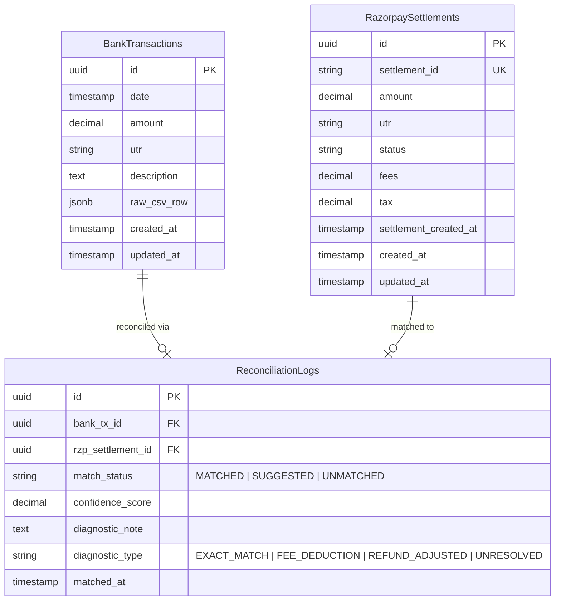

# ReconGrid AI — Technical Architecture

## 1. High-Level Data Flow

```
[ Frontend: Next.js + Tailwind CSS ]
         |
         |  1. Upload Bank Statement CSV (multipart/form-data)
         v
[ Ingestion Layer: CSV Parser & Sanitizer ]
         |
         |  2. Structured Bank Records (Normalized JSON)
         v
[ PostgreSQL Database (via Prisma ORM) ] <-----+
         ^                                     |
         |  3. Fetch Settlement & Refund Data  |
         |     (Automated Pagination)          |
[ Fetcher Service: Razorpay Node SDK ]         |
         |                                     |
         |  4. Load Bank & Razorpay Datasets   |
         v                                     |
[ Reconciliation Engine ] ---------------------+ 5. Store Matches, Statuses & Diagnostics
         |
         |  6. Query Reconciled / Unmatched / Diagnostic Datasets
         v
[ Presentation Layer: Next.js High-Density Dashboard ]
```

---

## 2. Component Breakdown

### 2.1 Ingestion Layer (`/src/services/ingestion`)
* **Responsibility**: Ingests raw bank statement CSV files uploaded by users.
* **Core Functions**:
  * Streams and parses varying bank CSV layouts using robust delimiter and header detection.
  * Cleans, sanitizes, and normalizes records into canonical bank transactions (`date`, `amount`, `utr`, `description`, `raw_csv_row`).
  * Persists records in batch to the `BankTransactions` table.

### 2.2 Fetcher Service (`/src/services/razorpay`)
* **Responsibility**: Interfaces with Razorpay REST APIs and Webhook endpoints.
* **Core Functions**:
  * Calls `/v1/settlements` with date range filters (`from`, `to`) and paginated loops.
  * Calls `/v1/refunds` to retrieve refund metadata for discrepancy heuristics.
  * Ingests real-time settlement events via the `/api/webhooks/razorpay` endpoint.
  * Persists and updates records in the `RazorpaySettlements` table.

### 2.3 Reconciliation Engine (`/src/services/reconciliation`)
* **Responsibility**: Deterministic & heuristic matching and diagnostic analysis.
* **Core Functions**:
  * **Tier 1 (Exact Match)**: Executes index-backed matching on normalized UTR and exact settlement amount -> Marks status as `MATCHED`.
  * **Tier 2 (Fuzzy Match)**: Applies string distance metrics (e.g., Levenshtein distance) on descriptor strings where UTR is malformed or truncated -> Marks status as `SUGGESTED`.
  * **Tier 3 (Diagnostics)**: Evaluates amount deltas:
    $$\Delta = \text{Bank Amount} - \text{Razorpay Gross Amount}$$
    Evaluates whether $\Delta$ matches $\text{Fees} + \text{GST}$ or matches an aggregated refund batch. Generates structured `diagnostic_note` entries.
  * Persists execution logs and mapping relations into `ReconciliationLogs`.

### 2.4 Presentation Layer (`/src/app` or `/src/views`)
* **Responsibility**: Next.js client-side interface for finance teams.
* **Core Functions**:
  * Side-by-side reconciliation ledger showing Bank Records vs. Razorpay Settlements.
  * Single-click acceptance/rejection of `SUGGESTED` matches.
  * Real-time metrics: Auto-Reconciliation rate, Pending Discrepancies, and Total Gateway Fees.
  * Exportable audit reports (CSV/JSON/PDF).

---

## 3. Database Schema (Entity Relationship Diagram)



---

## 4. Security Boundaries

* **Zero Frontend Exposure of Secrets**:
  * `RAZORPAY_KEY_ID` and `RAZORPAY_KEY_SECRET` are strictly kept in server-side environment variables (`.env`).
  * No client-side code will ever import or reference the Razorpay Secret Key.
* **Cryptographic Webhook Verification**:
  * All incoming webhook payloads at `/api/webhooks/razorpay` must validate the `X-Razorpay-Signature` header.
  * Verification uses Node's `crypto.createHmac('sha256', RAZORPAY_WEBHOOK_SECRET)` against raw unparsed request bodies before processing.
* **Data Sanitization**:
  * CSV input streams are validated against MIME types, file size limits, and malicious payload injection before parsing.

---

## 5. API Rate Limiting & Pagination

* **Pagination Strategy**:
  * Razorpay API limits result sets (default 10, max 100 per page).
  * The Fetcher Service executes an iterative cursor-based or offset pagination loop (`count=100`, `skip=N`) until `items.length < count` or `has_more === false`.
* **Rate-Limit Resilience & Exponential Backoff**:
  * API calls implement retry logic with exponential backoff and jitter to adhere to Razorpay HTTP 429 (Too Many Requests) headers.
  * Concurrency throttles ensure bulk settlement syncs do not overwhelm external API quotas.
